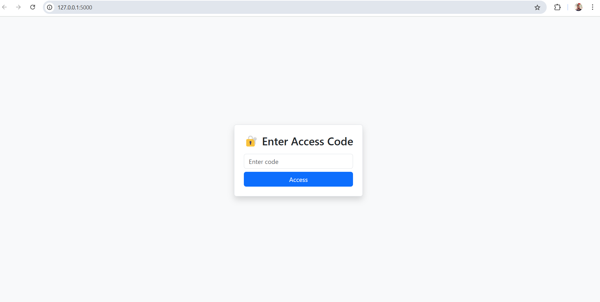
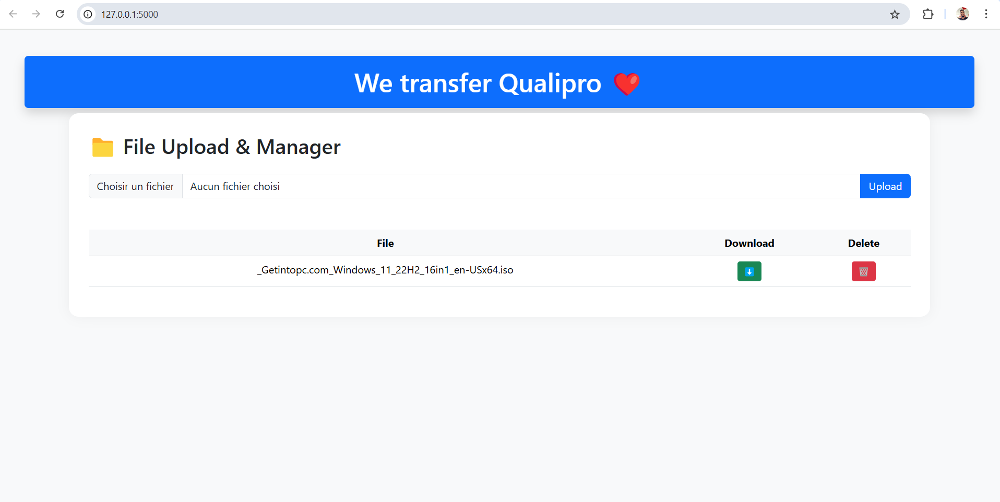

 **guide  installation :** 

**python -m venv .venv**

**.venv\Scripts\activate

pip install flask

pip install mysql-connector-python

pip install pymysql

pip install flask flask_sqlalchemy mysql-connector-python werkzeug

CREATE DATABASE code_auth CHARACTER SET utf8mb4 COLLATE utf8mb4_unicode_ci;

USE code_auth;

CREATE TABLE codes (
    id INT AUTO_INCREMENT PRIMARY KEY,
    code_hash VARCHAR(255) NOT NULL,
    created_at TIMESTAMP DEFAULT CURRENT_TIMESTAMP
);**
